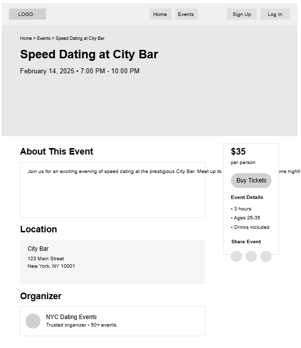

# Feb25-hackathon

## WireFrames

### Home Page

### Events Filter Page

### Simple Events list page

### Events Details

### Login Page

This project is a dating events app where you can select events around the uk to book and join. 

# UX

## Wireframes

## User Stories

- As a user, when I go on the website it should be clear what the website is about and its purpose, so that that I know whether to I want to view the website or not.
- As a user, I should be able to register for an account, so I am able to sign in and book events that I want to go to.
- As a user, I should be able to log in to the app so I am able to register and book for events to go to.
- As a user, I should be able to view a range of events in different categories on the website so I know which area of the website to visit.
- As a user, I should be able to search for events via a filter, so I can view events most suitable for me.
- As a user, events I have booked should be added to my profile, so I can see events that I have already booked.
- As a user, I expect the app to be responsive on a range of devices, so I am able to view the app on differeent devices.
- As an admin, I should be able to create, read, edit, and delete events so I can keep the platform updated with the most relevant events.

# Technologies used
- HTML
- CSS
- Tailwind CSS
- Javascript
- Python
- Django

# Features

# Deployment

## Deployment to Heroku

Go to Heroku.com and implement the following steps in this order:

1. On the home page, click 'New' and in the dropdown, click on 'Create a new app'.
2. Add app name (This name must be unique, and have all lower case letters. Also use minus/dash signs instead of spaces.)
3. Select Region (Select the most relevant region, mine is Europe)
4. Click the button that says 'Create App'.
5. Click on the Deploy tab near the top of the screen.
6. Where is says Deployment Method click on Github.
7. Below that, search for your repo name and add that.
8. Click connect to the app.

Before clicking below on enable automatic deployment do the following:

1. Click on the settings tab
2. Click on reveal config vars.
3. Add in your variables from your env. files as key value pairs. 
4. Go back and click on the Deploy tab.

Before the app can be connected, push the following new files below to the repository. Go back in the terminal in your coding environment and add the following:

1. git status
2. git add requirements.txt
3. git commit -m "Add requirements.txt file"
4. git add Procfile (web: gunicorn dating-event-app.wsgi:application)
5. git commit -m "Add Procfile"
6. git push

Head back over to Heroku where the Deploy tab is.

1. Click 'Enable Automatic Deploys'
2. Click Deploy Branch. (Should be a main or master branch)
Heroku will receive code from Github and build app with the required packages. Hopefully once done the 'App has successfully been deployed message below' will appear. 
3. Click 'View' to launch the new app. 
The deployed link of the app is http://dating-events-app-512687071453.herokuapp.com/

# Credits

# Acknowledgements

- Hannah: Scrum Master, Agile, and assisting in other odd tasks where needed
- Lochy: Design and frontend for the events page
- Finnbarr: Content for the events pages
- Anthony: Home/About Pages
- Denes: Database and Authentication 
- Kieran: Contact/FAQ pages
- Emma: Team Members Page and assisting in other odd tasks where needed.
